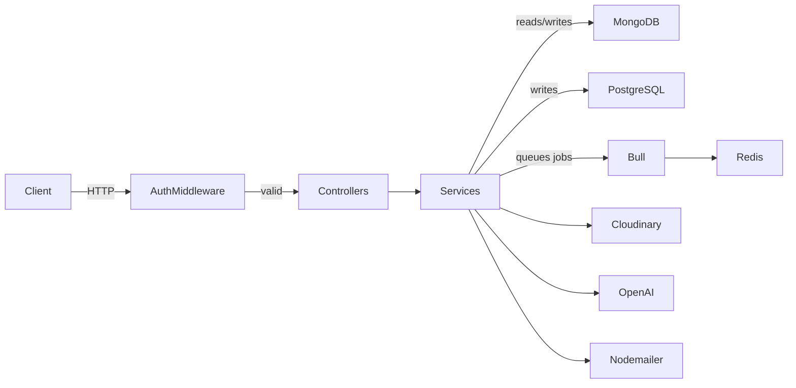
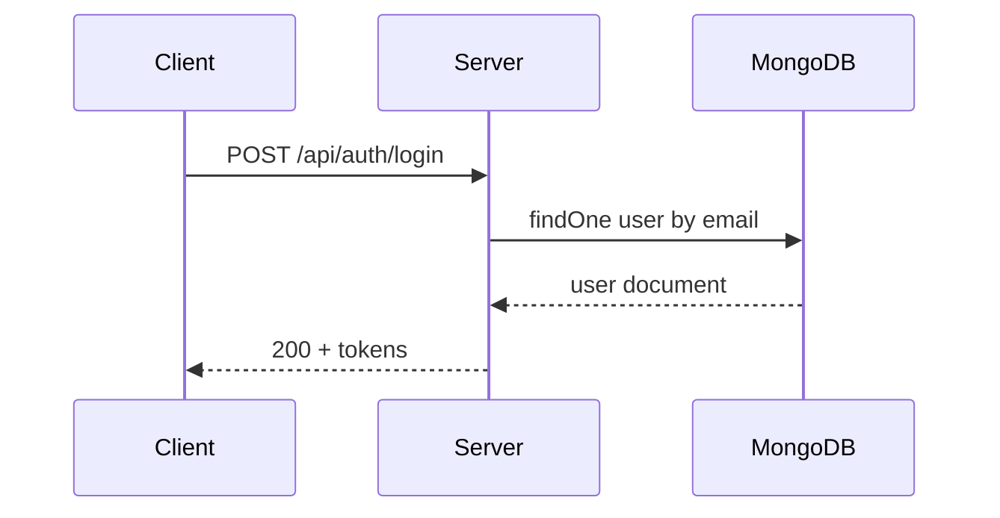

# Flow Diagrams & Explanation

This document contains simple visual representations of the major request and
data flows within the Job Tracker API. These diagrams are written in Mermaid
markdown and render directly on GitHub.

## High‑level Architecture

The arrows indicate direction of communication. Each major component is
isolated into its own folder under `src/`:

- **auth middleware** verifies JWTs and attaches a `user` payload to the
  request.
- **controllers** receive requests and call service methods.
- **services** perform business logic and interact with databases or external
  APIs.
- **Bull queue** handles long-running AI jobs asynchronously using Redis.
- **Cloudinary** is used for storing uploaded resume files.
- **PostgreSQL** holds monthly analytics data.
- **OpenAI/Groq** powers all AI features (analysis, cover letters, etc.).

## Request/Response Example

The diagrams above are intentionally simple; they can be copied and modified
for presentations or further documentation.
